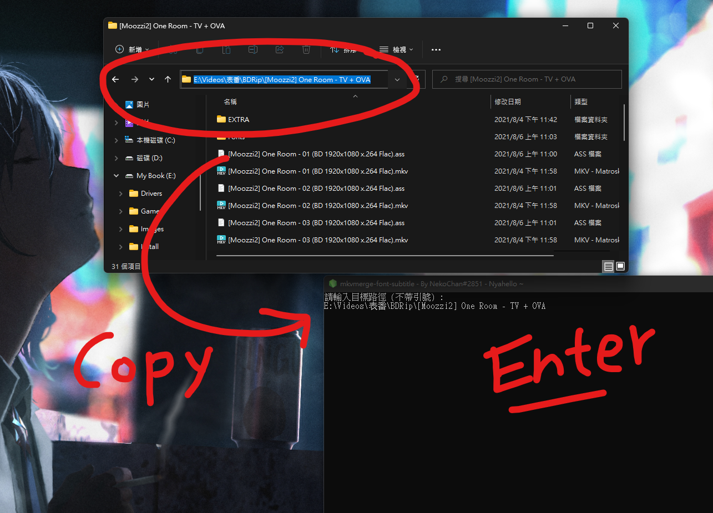
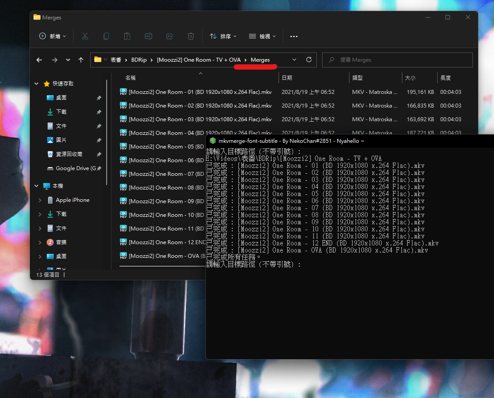

# mkvmerge-font-subtitle

> 是的，沒錯，我非常不會取名。

## 如何下載？

1. 在 [Releases](https://github.com/NekoChanTaiwan/mkvmerge-font-subtitle/releases) 下載最新建置版本。
2. 解壓縮後開啟 `mkvmerge-font-subtitle_xXX.exe`

> 如果你操作系統下的環境變量有配置 mkvmerge.exe，你可以將解壓縮後包含的 mkvmerge.exe 刪除。

## 如何使用？

1. 使用前請先確認目標路徑的結構是否如下。

```
- [Moozzi2] One Room - TV + OVA /
  - Fonts /
    - DFKai7_1.ttc
    - fzbwks_gbk.ttf
    - ...
  - [Moozzi2] One Room - 01 (BD 1920x1080 x.264 Flac).ass
  - [Moozzi2] One Room - 01 (BD 1920x1080 x.264 Flac).mkv
  - [Moozzi2] One Room - 02 (BD 1920x1080 x.264 Flac).ass
  - [Moozzi2] One Room - 02 (BD 1920x1080 x.264 Flac).mkv
  - ...
```

- 資料夾下的影片與字幕必須同名且數量一致
- 字體請放在相對目標路徑下的 Fonts 資料夾

2. 開啟 `mkvmerge-font-subtitle_xXX.exe` 輸入目標路徑並按下 `Enter`，並等待提示 `已完成所有任務。`



3. 提示 `已完成所有任務。` 後，所有檔案默認會輸出至相對路徑下的 `Merges` 資料夾。



4. 可以給我 Star 了吧 :3

## 影片教學

https://youtu.be/O-HsLcSty2E

## License

[MIT](https://github.com/NekoChanTaiwan/mkvmerge-font-subtitle/blob/main/LICENSE)
